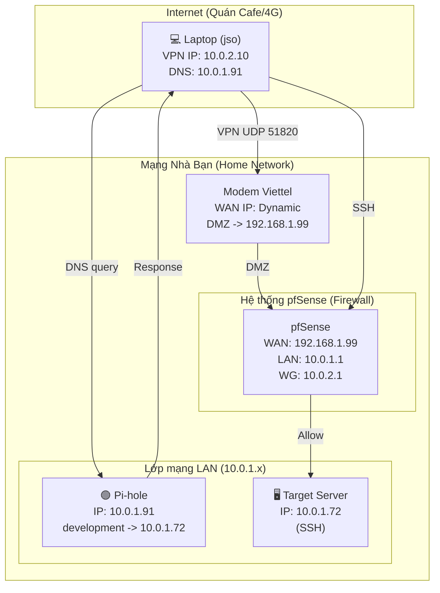
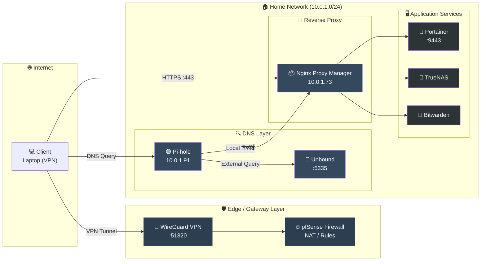

```mermaid
graph TD
    subgraph "Internet (Quán Cafe/4G)"
        Laptop["💻 Laptop (jso)<br>VPN IP: 10.0.2.10<br>DNS: 10.0.1.91"]
    end

    subgraph "Mạng Nhà Bạn (Home Network)"
        Modem["Modem Viettel<br>WAN IP: Dynamic<br>DMZ -> 192.168.1.99"]
        
        subgraph "Hệ thống pfSense (Firewall)"
            pfsense["pfSense<br>WAN: 192.168.1.99<br>LAN: 10.0.1.1<br>WG: 10.0.2.1"]
        end

        subgraph "Lớp mạng LAN (10.0.1.x)"
            Pihole["🟢 Pi-hole<br>IP: 10.0.1.91<br>development -> 10.0.1.72"]
            Server["🖥️ Target Server<br>IP: 10.0.1.72<br>(SSH)"]
        end
    end

    Laptop -->|VPN UDP 51820| Modem
    Modem -->|DMZ| pfsense
    
    Laptop -->|DNS query| Pihole
    Pihole -->|Response| Laptop
    
    Laptop -->|SSH| pfsense
    pfsense -->|Allow| Server
```

# V2

```mermaid
flowchart LR
    %% ================= INTERNET =================
    subgraph INTERNET["🌐 Internet"]
        User["💻 Client<br/>Laptop (VPN)"]
    end

    %% ================= EDGE =================
    subgraph EDGE["🛡️ Edge / Gateway Layer"]
        WG["🔐 WireGuard VPN<br/>:51820"]
        FW["🔥 pfSense Firewall<br/>NAT / Rules"]
    end

    %% ================= NETWORK CORE =================
    subgraph CORE["🏠 Home Network (10.0.1.0/24)"]

        subgraph DNS["🔍 DNS Layer"]
            Pihole["🟢 Pi-hole<br/>10.0.1.91"]
            Unbound["🔄 Unbound<br/>:5335"]
        end

        subgraph PROXY["🚀 Reverse Proxy"]
            NPM["📦 Nginx Proxy Manager<br/>10.0.1.73"]
        end

        subgraph SERVICES["🖥️ Application Services"]
            Portainer["🐳 Portainer<br/>:9443"]
            TrueNAS["💾 TrueNAS"]
            Bitwarden["🔐 Bitwarden"]
        end
    end

    %% ================= CONNECTION FLOW =================
    User -->|"VPN Tunnel"| WG
    WG --> FW

    %% DNS Flow
    User -->|"DNS Query"| Pihole
    Pihole -->|"Local रिकॉर्ड"| NPM
    Pihole -->|"External Query"| Unbound

    %% Traffic Flow
    User -->|"HTTPS :443"| NPM
    NPM --> Portainer
    NPM --> TrueNAS
    NPM --> Bitwarden

    %% ================= STYLING =================
    classDef edge fill:#2c3e50,color:#fff,stroke:#34495e;
    classDef infra fill:#34495e,color:#fff;
    classDef service fill:#2d3436,color:#fff;

    class WG,FW edge;
    class Pihole,Unbound,NPM infra;
    class Portainer,TrueNAS,Bitwarden service;
```