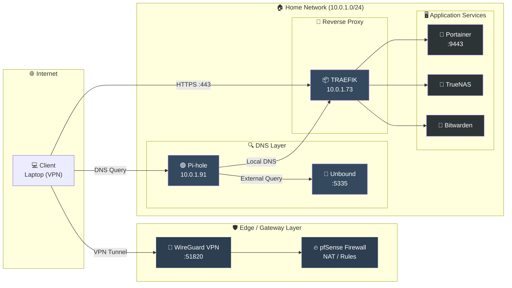

# V2

```mermaid
flowchart LR
    %% ================= INTERNET =================
    subgraph INTERNET["🌐 Internet"]
        User["💻 Client<br/>Laptop (VPN)"]
    end

    %% ================= EDGE =================
    subgraph EDGE["🛡️ Edge / Gateway Layer"]
        WG["🔐 WireGuard VPN<br/>:51820"]
        FW["🔥 pfSense Firewall<br/>NAT / Rules"]
    end

    %% ================= NETWORK CORE =================
    subgraph CORE["🏠 Home Network (10.0.1.0/24)"]

        subgraph DNS["🔍 DNS Layer"]
            Pihole["🟢 Pi-hole<br/>10.0.1.91"]
            Unbound["🔄 Unbound<br/>:5335"]
        end

        subgraph PROXY["🚀 Reverse Proxy"]
            TRAEFIK["📦 TRAEFIK<br/>10.0.1.73"]
        end

        subgraph SERVICES["🖥️ Application Services"]
            Portainer["🐳 Portainer<br/>:9443"]
            TrueNAS["💾 TrueNAS"]
            Bitwarden["🔐 Bitwarden"]
        end
    end

    %% ================= CONNECTION FLOW =================
    User -->|"VPN Tunnel"| WG
    WG --> FW

    %% DNS Flow
    User -->|"DNS Query"| Pihole
    Pihole -->|"Local DNS"| TRAEFIK
    Pihole -->|"External Query"| Unbound

    %% Traffic Flow
    User -->|"HTTPS :443"| TRAEFIK
    TRAEFIK --> Portainer
    TRAEFIK --> TrueNAS
    TRAEFIK --> Bitwarden

    %% ================= STYLING =================
    classDef edge fill:#2c3e50,color:#fff,stroke:#34495e;
    classDef infra fill:#34495e,color:#fff;
    classDef service fill:#2d3436,color:#fff;

    class WG,FW edge;
    class Pihole,Unbound,TRAEFIK infra;
    class Portainer,TrueNAS,Bitwarden service;
```