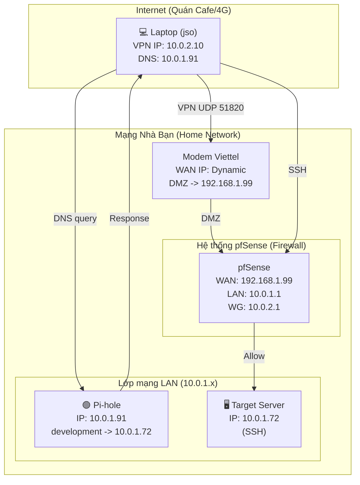

```mermaid
graph TD
    subgraph "Internet (Quán Cafe/4G)"
        Laptop["💻 Laptop (jso)<br>VPN IP: 10.0.2.10<br>DNS: 10.0.1.91"]
    end

    subgraph "Mạng Nhà Bạn (Home Network)"
        Modem["Modem Viettel<br>WAN IP: Dynamic<br>DMZ -> 192.168.1.99"]
        
        subgraph "Hệ thống pfSense (Firewall)"
            pfsense["pfSense<br>WAN: 192.168.1.99<br>LAN: 10.0.1.1<br>WG: 10.0.2.1"]
        end

        subgraph "Lớp mạng LAN (10.0.1.x)"
            Pihole["🟢 Pi-hole<br>IP: 10.0.1.91<br>development -> 10.0.1.72"]
            Server["🖥️ Target Server<br>IP: 10.0.1.72<br>(SSH)"]
        end
    end

    Laptop -->|VPN UDP 51820| Modem
    Modem -->|DMZ| pfsense
    
    Laptop -->|DNS query| Pihole
    Pihole -->|Response| Laptop
    
    Laptop -->|SSH| pfsense
    pfsense -->|Allow| Server
```