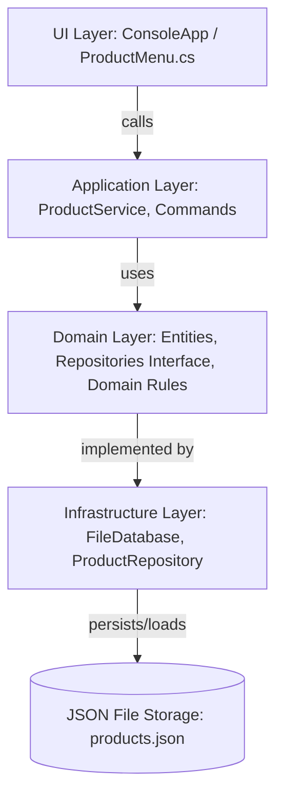

```mermaid
graph TD

A[UI Layer: ConsoleApp / ProductMenu.cs] -->|calls| B[Application Layer: ProductService, Commands]
B -->|uses| C[Domain Layer: Entities, Repositories Interface, Domain Rules]
C -->|implemented by| D[Infrastructure Layer: FileDatabase, ProductRepository]
D -->|persists/loads| E[(JSON File Storage: products.json)]
```

