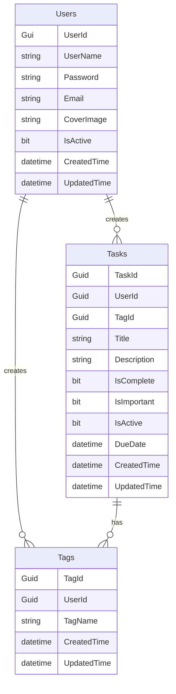

```mermaid
erDiagram
    %% === Core Entities ===
    Users {
        Gui UserId
        string UserName
        string Password
        string Email
        string CoverImage
        bit IsActive
        datetime CreatedTime
        datetime UpdatedTime
    }

    Tasks {
        Guid TaskId
        Guid UserId
        Guid TagId
        string Title
        string Description
        bit IsComplete
        bit IsImportant
        bit IsActive
        datetime DueDate
        datetime CreatedTime
        datetime UpdatedTime
    }

    Tags {
        Guid TagId
        Guid UserId
        string TagName
        datetime CreatedTime
        datetime UpdatedTime
    }

    %% === Relationships ===
    Users ||--o{ Tasks : "creates"
    Users ||--o{ Tags : "creates"

    Tasks ||--o{ Tags : "has"

```

