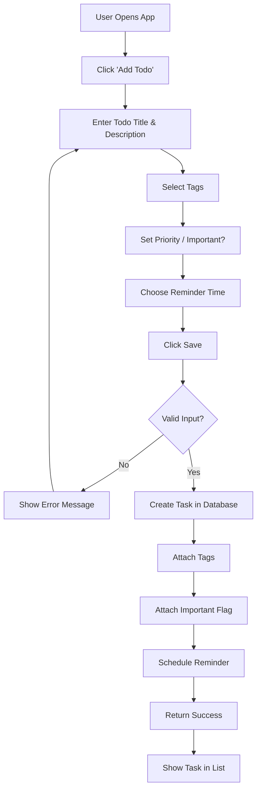
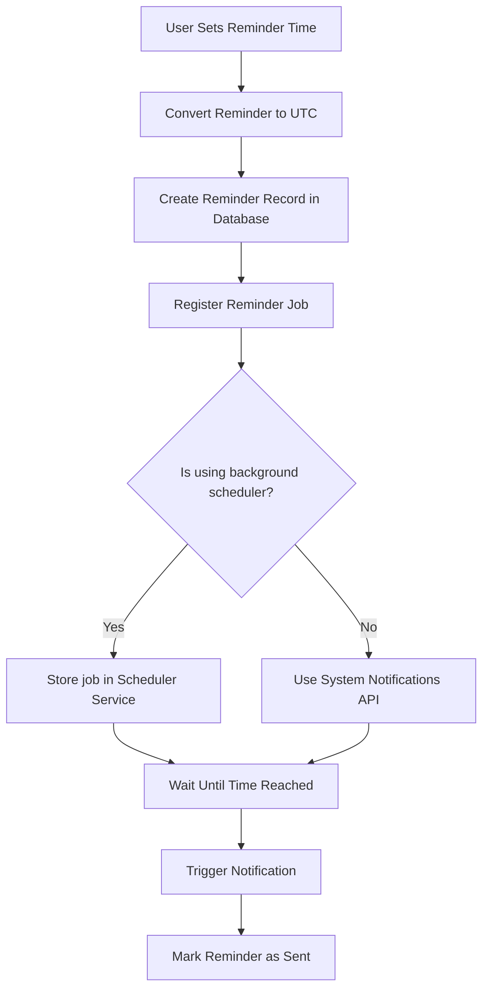

## 1. Create task workflow

```mermaid
flowchart TD
    A[User Opens App] --> B[Click 'Add Todo']
    B --> C[Enter Todo Title & Description]
    C --> D[Select Tags]
    D --> E[Set Priority / Important?]
    E --> F[Choose Reminder Time]
    F --> G[Click Save]
  
    G --> H{Valid Input?}
    H -->|No| I[Show Error Message]
    I --> C

    H -->|Yes| J[Create Task in Database]
    J --> K[Attach Tags]
    K --> L[Attach Important Flag]
    L --> M[Schedule Reminder]
    M --> N[Return Success]

    N --> O[Show Task in List]
```

## 2. Reminder Scheduling Flow

```mermaid
flowchart TD
    A[User Sets Reminder Time] --> B[Convert Reminder to UTC]
    B --> C[Create Reminder Record in Database]
    C --> D[Register Reminder Job]
    D --> E{Is using background scheduler?}

    E -->|Yes| F[Store job in Scheduler Service]
    E -->|No| G[Use System Notifications API]

    F --> H[Wait Until Time Reached]
    G --> H

    H --> I[Trigger Notification]
    I --> J[Mark Reminder as Sent]
```

