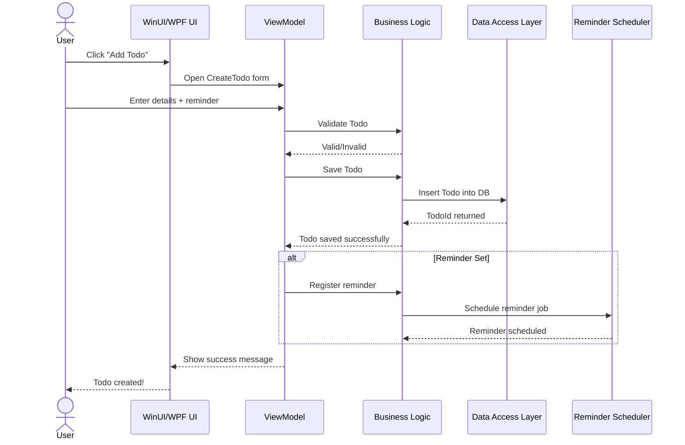

```mermaid
sequenceDiagram
    actor User
    participant UI as WinUI/WPF UI
    participant VM as ViewModel
    participant BLL as Business Logic
    participant DAL as Data Access Layer
    participant SCH as Reminder Scheduler

    User ->> UI: Click "Add Todo"
    UI ->> VM: Open CreateTodo form
    User ->> VM: Enter details + reminder
    VM ->> BLL: Validate Todo
    BLL -->> VM: Valid/Invalid

    VM ->> BLL: Save Todo
    BLL ->> DAL: Insert Todo into DB
    DAL -->> BLL: TodoId returned
    BLL -->> VM: Todo saved successfully

    alt Reminder Set
        VM ->> BLL: Register reminder
        BLL ->> SCH: Schedule reminder job
        SCH -->> BLL: Reminder scheduled
    end

    VM -->> UI: Show success message
    UI -->> User: Todo created!

```

