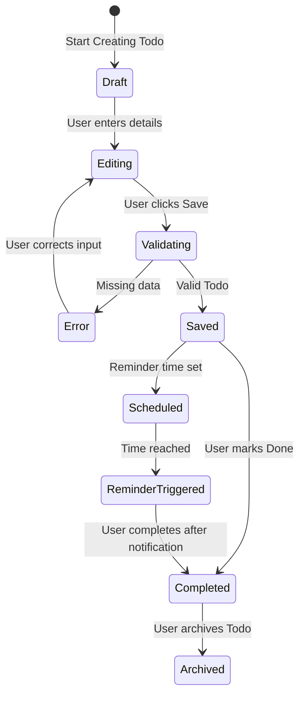

```mermaid
stateDiagram-v2
    [*] --> Draft : Start Creating Todo
    Draft --> Editing : User enters details
    Editing --> Validating : User clicks Save
    Validating --> Error : Missing data
    Error --> Editing : User corrects input

    Validating --> Saved : Valid Todo

    Saved --> Scheduled : Reminder time set
    Saved --> Completed : User marks Done

    Scheduled --> ReminderTriggered : Time reached
    ReminderTriggered --> Completed : User completes after notification

    Completed --> Archived : User archives Todo
```

