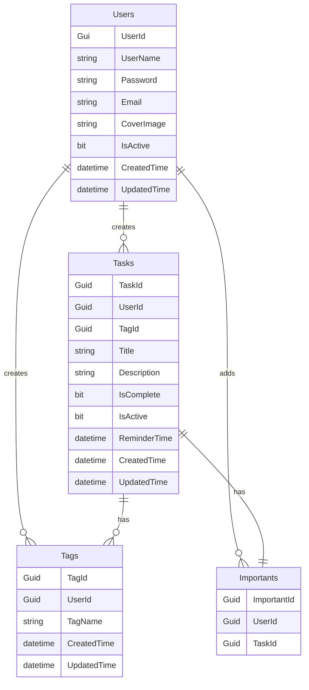

We'll cover the following

+ [🎯 Project Overview](#🎯-project-overview)
+ [ 🛠️Technology Stack](#🛠️-technology-stack)
+ [🏗️ System Architecture](#🏗️-system-architecture)
+ [🎨 Database Design](#🎨-database-design)
+ [📚 Document References](#📚-document-references)

## 🎯 Project Overview

Todo’s is a lightweight and intuitive task management app designed to help you stay organized every day. With a clean interface and smooth workflow, you can create, edit, and track your tasks effortlessly — staying focused on what really matters.

A Windows desktop application built using WPF (Windows Presentation Foundation) with the MVVM (Model–View–ViewModel) architecture.

![[logo.png]]
## 🛠️ Technology Stack

+ .NET 10.0 - Main Framework
+ WinUI with MVVM architecture - UI
+ Entity Framework Core - ORM
+ MSSQL Server - Database
+ BCrypt.NET - Securely hashing and Verifying passwords
## 🏗️ System Architecture

```
[ WinUi  MVVM Application ]
   ↓
[ Database (MSSQL) ]
   ↓
[ File Storage (Local / S3 / MinIO) ]
```
## 🎨 Database Design

Our system will have total 4 Entities:

+ Users: User management and authorization
+ Tasks: Store tasks for each user
+ Tags: Store tags for each task
+ Importants: Store the which task is important



## 📑 Create Task Workflow


## 📚 Document References
### Project Documentation
+ [⚙️ Project Main Flow](MAIN_FLOW.md)
+ [📰 Features](FEATURE.MD)
+ [🗄️ Database Overview](DATABASE.md)
