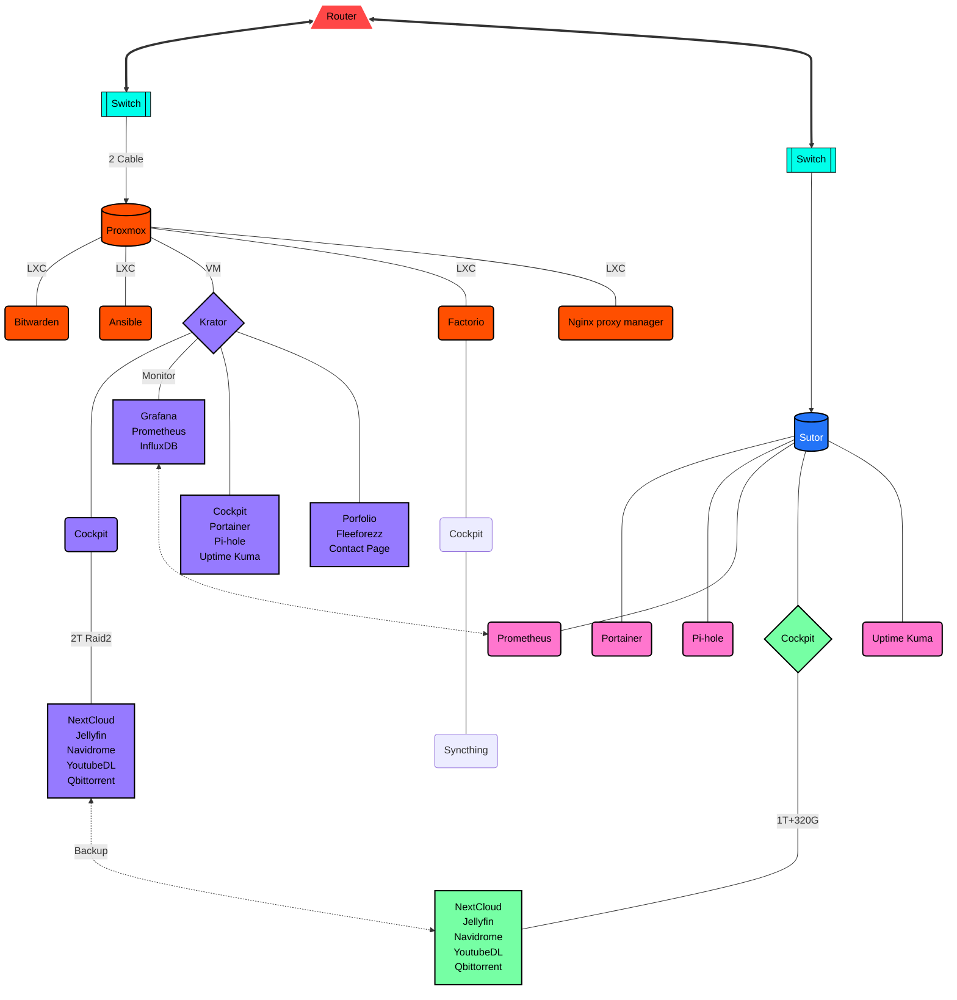

---
+ Service 
---
#### Server Tree

```mermaid
---
Home Server
---
flowchart TB

%% Color %%
classDef red fill:#FF4747,stroke:#ffffff, stroke-width:2px, color:#000
classDef blue fill:#2374f7, stroke:#000, stroke-width:2px, color:#fff
classDef light-pink fill:#FF76CE, stroke:#000, stroke-width:2px, color:#000
classDef purple fill:#967AFF, stroke:#000, stroke-width:2px, color:#000
classDef orange fill:#FF4F00,stroke:#000, stroke-width:2px, color:#000
classDef green fill:#76FFA4,stroke:#000, stroke-width:2px, color:#000
classDef oral-green fill:#00FFEA,stroke:#000, strock-width:2px, color:#000

%% Network Layer &&
RO[/Router\]:::red <===> SW1[[Switch]]:::oral-green
RO <===> SW2[[Switch]]:::oral-green

%% Nodes Layer %%
SW1 ---> |2 Cable| PR[(Proxmox)]:::orange
SW2 ----> SU[(Sutor)]:::blue

%% Proxmox VM and LXC and Services Layer %%
%% VM and LXC %%
PR --- |LXC| BI(Bitwarden):::orange
PR --- |LXC| AN(Ansible):::orange
PR --- |VM| KR{Krator}:::purple
PR --- |LXC| FA(Factorio):::orange
PR --- |LXC| NG(Nginx proxy manager):::orange
%% Services %%
%% Krator %%
KR ---- CO1(Cockpit):::purple
CO1 ---- |2T Raid2| useStorage["`
	NextCloud
	Jellyfin
	Navidrome
	YoutubeDL
	Qbittorrent
`"]:::purple

KR --- |Monitor| monitor["`
	Grafana
	Prometheus
	InfluxDB
`"]:::purple
monitor <-..-> PRO

KR ---- Other["`
	Cockpit
	Portainer
	Pi-hole
	Uptime Kuma
`"]:::purple

KR ---- Projects["`
	Porfolio
	Fleeforezz
	Contact Page
`"]:::purple
%% Factorio %%
FA ---- CO3(Cockpit)
CO3 ---- SY(Syncthing)

%% Sutor Backup and Services Layer %%
%% Services %%
SU ---- PO2(Portainer):::light-pink
SU ---- PI2(Pi-hole):::light-pink
SU ---- PRO(Prometheus):::light-pink
SU ---- CO2{Cockpit}:::green
SU ---- UP2(Uptime Kuma):::light-pink
%% Backup %%
CO2 ---- |1T+320G| useBackup["`
	NextCloud
	Jellyfin
	Navidrome
	YoutubeDL
	Qbittorrent
`"]:::green
useStorage <-..-> |Backup| useBackup
```
